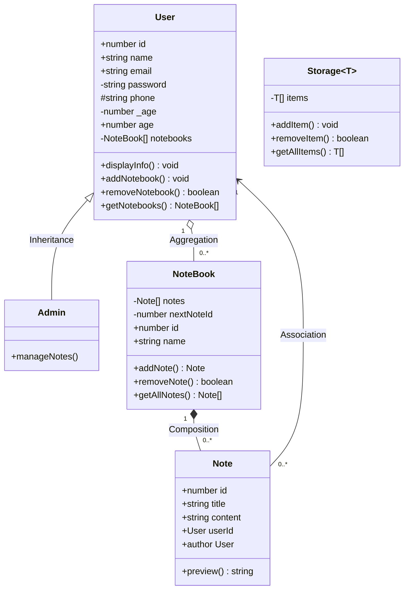

# UML Class Diagram

This diagram represents the Simple Notes Management System.

```mermaid
classDiagram

class User {
    +number id
    +string name
    +string email
    -string password
    #string phone
    -number _age
    +number age
    -NoteBook[] notebooks
    +displayInfo() void
    +addNotebook() void
    +removeNotebook() boolean
    +getNotebooks() NoteBook[]
}

class Admin {
    +manageNotes() 
}

class Note {
    +number id
    +string title
    +string content
    +User userId
    +author User
    +preview() string
}

class NoteBook {
    -Note[] notes
    -number nextNoteId
    +number id
    +string name
    +addNote() Note
    +removeNote() boolean
    +getAllNotes() Note[]
}

class Storage~T~ {
    -T[] items
    +addItem() void
    +removeItem() boolean
    +getAllItems() T[]
}

User <|-- Admin : Inheritance

User "1" o-- "0..*" NoteBook : Aggregation

NoteBook "1" *-- "0..*" Note : Composition

Note "0..*" --> "1" User : Association
```
